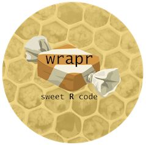

<!-- README.md is generated from README.Rmd. Please edit that file -->
This document describes `wrapr`, an [R](https://cran.r-project.org) package available from [Github](https://github.com/WinVector/wrapr) (via `devtools::install_github("WinVector/wrapr")`) and [CRAN](https://CRAN.R-project.org/) (via `install.packages("wrapr")`).

Note: `wrapr` is meant only for "tame names" that is variables and column names that are also valid *simple* (without quotes) `R` variables names.

Introduction
------------

`wrapr` wraps `R` functions debugging and better standard evaluation.



Primary `wrapr` services include:

-   `wrapr::let()`
-   `wrapr::%.>%` (dot arrow pipe)
-   `wrapr::DebugFnW()`

`wrapr::let()`
--------------

`wrapr::let()` allows execution of arbitrary code with substituted variable names (note this is subtly different than binding values for names as with `base::substitute()` or `base::with()`).

The function is simple and powerful. It treats strings as variable names and re-writes expressions as if you had used the denoted variables. For example the following block of code is equivalent to having written "`a + a`".

``` r
library("wrapr")

a <- 7

let(
  c(VAR = 'a'),
  
  VAR + VAR
)
 #  [1] 14
```

This is useful in re-adapting non-standard evaluation interfaces (NSE interfaces) so one can script or program over them.

We are trying to make `wrapr::let()` self teaching and self documenting (to the extent that makes sense). For example try the arguments "`eval=FALSE`" prevent execution and see what *would* have been executed, or `debug=TRUE` to have the replaced code printed in addition to being executed:

``` r
let(
  c(VAR = 'a'),
  eval = FALSE,
  {
    VAR + VAR
  }
)
 #  {
 #      a + a
 #  }

let(
  c(VAR = 'a'),
  debugPrint = TRUE,
  {
    VAR + VAR
  }
)
 #  {
 #      a + a
 #  }
 #  [1] 14
```

Please see `vignette('let', package='wrapr')` for more examples.

`wrapr::%.>%` (dot arrow pipe)
------------------------------

`wrapr::%.>%` dot arrow pipe is a strict pipe with intended semantics:

> "a %.&gt;% b" is to be treated as if the user had written "{ . &lt;- a; b };" with "%.&gt;%" being treated as left-associative, and .-side effects removed.

That is: `%.>%` does not alter any function arguments that are not explicitly named. It is not defined as `a %.% b ~ b(a)` (roughly `dplyr`'s original pipe) or as the large set of differing cases constituting `magrittr::%>%`. `wrapr::%.>%` is designed to be explicit and simple.

The effect looks is show below.

The following two expressions should be equivalent:

``` r
cos(exp(sin(4)))
 #  [1] 0.8919465

4 %.>% sin(.) %.>% exp(.) %.>% cos(.)
 #  [1] 0.8919465
```

Please see ["In Praise of Syntactic Sugar"](http://www.win-vector.com/blog/2017/07/in-praise-of-syntactic-sugar/) for more details.

`wrapr::DebugFnW()`
-------------------

`wrapr::DebugFnW()` wraps a function for debugging. If the function throws an exception the execution context (function arguments, function name, and more) is captured and stored for the user. The function call can then be reconstituted, inspected and even re-run with a step-debugger. Please see `vignette('DebugFnW', package='wrapr')` for examples.
