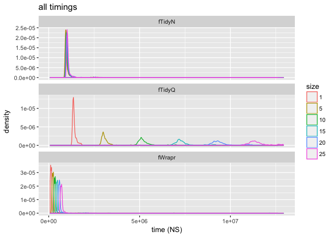

Keep in mind for any *serious* application the calculation time on data will far dominate any expression re-write time from either `rlang`/`tidyeval` or `wrapr`. But it has been [asked what the timings are](http://www.win-vector.com/blog/2017/06/please-consider-using-wraprlet-for-replacement-tasks/#comment-66574), and it is fun to look.

So we will compare:

-   `fWrapr*` `wrapr::let()` substitution (`"langsubs"` mode).
-   `fTidyN*` `rlang::eval_tidy()` substitution to quoted names (the closest I found to `wrapr::let()`).
-   `fTidyQ*` `rlang::eval_tidy()` substitution to `quo()` free names (what seems to be the preferred case/notation by `rlang` developers as it moves from NSE (non-standard evaluation interface) to NSE).

``` r
library("microbenchmark")
library("wrapr")
library("rlang")
library("ggplot2")
suppressPackageStartupMessages(library("dplyr"))

a <-  1
b <-  2
c <-  3
d <-  4
e <-  5
f <-  6
g <-  7
h <-  8
i <-  9
j <- 10

fWrapr1 <- function() {
  wrapr::let(
    c(VAR1= 'a'),
    VAR1
  )
}

fTidyN1 <- function() {
  TV1 = as.name('a')
  
  eval_tidy(quo( (!!TV1) ))
}

fTidyQ1 <- function() {
  TV1 = quo(a)
  
  eval_tidy(quo( (!!TV1) ))
}

fWrapr1()
```

    ## [1] 1

``` r
fTidyN1()
```

    ## [1] 1

``` r
fTidyQ1()
```

    ## [1] 1

``` r
fWrapr5 <- function() {
  wrapr::let(
    c(VAR1= 'a', VAR2= 'b', VAR3= 'c', VAR4= 'd', VAR5= 'e'),
    VAR1 + VAR2 + VAR3 + VAR4 + VAR5
  )
}

fTidyN5 <- function() {
  TV1 =  as.name('a')
  TV2 =  as.name('b')
  TV3 =  as.name('c')
  TV4 =  as.name('d')
  TV5 =  as.name('e')
  
  eval_tidy(quo( (!!TV1) + (!!TV2) + (!!TV3) + (!!TV4) + (!!TV5) ))
}

fTidyQ5 <- function() {
  TV1 = quo(a)
  TV2 = quo(b)
  TV3 = quo(c)
  TV4 = quo(d)
  TV5 = quo(e)
  
  eval_tidy(quo( (!!TV1) + (!!TV2) + (!!TV3) + (!!TV4) + (!!TV5) ))
}

fWrapr5()
```

    ## [1] 15

``` r
fTidyN5()
```

    ## [1] 15

``` r
fTidyQ5()
```

    ## [1] 15

``` r
fWrapr10 <- function() {
  wrapr::let(
    c(VAR01= 'a', VAR02= 'b', VAR03= 'c', VAR04= 'd', VAR05= 'e',
      VAR06= 'f', VAR07= 'g', VAR08= 'h', VAR09= 'i', VAR10= 'j'),
    VAR01 + VAR02 + VAR03 + VAR04 + VAR05 +
      VAR06 + VAR07 + VAR08 + VAR09 + VAR10
  )
}

fTidyN10 <- function() {
  TV01 =  as.name('a')
  TV02 =  as.name('b')
  TV03 =  as.name('c')
  TV04 =  as.name('d')
  TV05 =  as.name('e')
  TV06 =  as.name('f')
  TV07 =  as.name('g')
  TV08 =  as.name('h')
  TV09 =  as.name('i')
  TV10 =  as.name('j')
  
  eval_tidy(quo( (!!TV01) + (!!TV02) + (!!TV03) + (!!TV04) + (!!TV05) +
                   (!!TV06) + (!!TV07) + (!!TV08) + (!!TV09) + (!!TV10) ))
}

fTidyQ10 <- function() {
  TV01 = quo(a)
  TV02 = quo(b)
  TV03 = quo(c)
  TV04 = quo(d)
  TV05 = quo(e)
  TV06 = quo(f)
  TV07 = quo(g)
  TV08 = quo(h)
  TV09 = quo(i)
  TV10 = quo(j)
  
  eval_tidy(quo( (!!TV01) + (!!TV02) + (!!TV03) + (!!TV04) + (!!TV05) +
                   (!!TV06) + (!!TV07) + (!!TV08) + (!!TV09) + (!!TV10) ))
}

fWrapr10()
```

    ## [1] 55

``` r
fTidyN10()
```

    ## [1] 55

``` r
fTidyQ10()
```

    ## [1] 55

``` r
bm <- microbenchmark(
  fWrapr1(),
  fTidyN1(),
  fTidyQ1(),
  fWrapr5(),
  fTidyN5(),
  fTidyQ5(),
  fWrapr10(),
  fTidyN10(),
  fTidyQ10(),
  times=1000L
)
print(bm)
```

    ## Unit: microseconds
    ##        expr      min        lq      mean    median        uq       max
    ##   fWrapr1()   91.433  121.4530  176.2621  167.5810  188.0125  2139.932
    ##   fTidyN1()  874.199  931.2350 1173.1325  977.3835 1196.2440  5845.849
    ##   fTidyQ1() 1244.919 1320.2530 1663.9862 1391.2795 1785.2260  8399.738
    ##   fWrapr5()  189.570  228.7015  306.6752  276.9290  309.8075  3655.244
    ##   fTidyN5()  887.161  947.4945 1215.8974  997.2010 1261.4300 13105.914
    ##   fTidyQ5() 2704.216 2852.1515 3576.2769 3020.6920 3810.2780 52277.314
    ##  fWrapr10()  303.655  358.1110  471.3713  409.3945  460.9975  8310.655
    ##  fTidyN10()  904.735  973.8165 1247.9337 1027.7800 1289.6480 11833.921
    ##  fTidyQ10() 4523.994 4815.8035 5938.2648 5152.9105 6481.9520 28247.704
    ##  neval
    ##   1000
    ##   1000
    ##   1000
    ##   1000
    ##   1000
    ##   1000
    ##   1000
    ##   1000
    ##   1000

``` r
autoplot(bm)
```


``` r
d <- as.data.frame(bm)
d$size <- as.numeric(gsub("[^0-9]+", "", d$expr))
d$fn <- gsub("[0-9].*$", "", d$expr)

mkPlot <- function(d, title) {
  d$size <- as.factor(d$size)
  highCut <- as.numeric(quantile(d$time, probs = 0.99))
  dcut <- d[d$time<=highCut, , drop=FALSE]
  
  ggplot(data=dcut, aes(x=time, group=expr, color=size)) +
    geom_density(adjust=0.3) +
    facet_wrap(~fn, ncol=1, scales = 'free_y') +
    xlab('time (NS)') + ggtitle(title)
}

mkPlot(d, 'all timings')
```



``` r
mkPlot(d[d$fn %in% c('fWrapr', 'fTidyN'), , drop=FALSE], 
       'fWrapr v.s. fTidyN')
```


``` r
mkPlot(d[d$fn %in% c('fTidyQ', 'fTidyN'), , drop=FALSE], 
       'fTidyQ v.s. fTidyN')
```


``` r
# fit a linear function for runtime as a function of size
# per group.
fits <- d %>%
  split(., .$fn) %>%
  lapply(., 
         function(di) { 
           lm(time ~ size, data=di) 
         }) %>%
  lapply(., coefficients) %>%
  lapply(., 
         function(ri) {
           data.frame(Intercept= ri[["(Intercept)"]],
                      size= ri[['size']])
         }) 
dfits <- bind_rows(fits)
dfits$fn <- names(fits)

# "Intercept" is roughly start-up cost 
# "size" is slope or growth rate
print(dfits)
```

    ##   Intercept       size     fn
    ## 1 1168410.8   8233.212 fTidyN
    ## 2 1193821.5 474816.470 fTidyQ
    ## 3  143190.8  32796.023 fWrapr

``` r
# solve for size where two lines interesect
solve <- function(dfits, f1, f2) {
  idx1 <- which(dfits$fn==f1)
  idx2 <- which(dfits$fn==f2)
  size <- (dfits$Intercept[[idx1]] - dfits$Intercept[[idx2]]) /
    (dfits$size[[idx2]] - dfits$size[[idx1]])
  size
}

crossingPoint <- solve(dfits, 'fTidyN', 'fWrapr')
print(crossingPoint)
```

    ## [1] 41.73871

Overall:

-   Remember: these timings are *not* important, for any interesting calculation data manipulation time will quickly dominate expression manipulation time (meaning [tuning here is not important](https://en.wikipedia.org/wiki/Amdahl%27s_law)).
-   `fWrapr*` is fastest, but seems to have worse size dependent growth rate (or slope) than `fTidyN*`. This means that we would expect at some large substitution size `fTidyN*` could become quicker (about 42 or more variables). Likely `wrapr::let()` is paying too much for a map-lookup somewhere and this could be fixed at some point.
-   `fTidyQ*` is very much slower with a much worse slope. Likely the slope is also some expensive mapping that can also be fixed.
