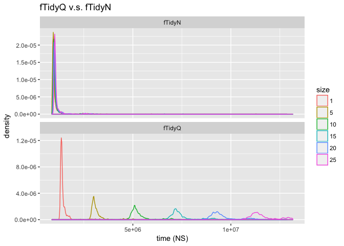

Some timings for [`wrapr::let()`](https://github.com/WinVector/wrapr).

Keep in mind for any *serious* application the calculation time on data will far dominate any expression re-write time from either `rlang`/`tidyeval` or `wrapr`. But it has been [asked what the timings are](http://www.win-vector.com/blog/2017/06/please-consider-using-wraprlet-for-replacement-tasks/#comment-66574), and it is fun to look.

So we will compare:

-   `fWrapr*` `wrapr::let()` substitution (`"langsubs"` mode).
-   `fTidyN*` `rlang::eval_tidy()` substitution to quoted names (the closest I found to `wrapr::let()`).
-   `fTidyQ*` `rlang::eval_tidy()` substitution to `quo()` free names (what seems to be the preferred case/notation by `rlang`/`tidyeval` developers as it moves from NSE (non-standard evaluation interface) to NSE).

``` r
library("microbenchmark")
library("wrapr")
library("rlang")
suppressPackageStartupMessages(library("ggplot2"))
suppressPackageStartupMessages(library("dplyr"))

# load generated examples
source("genFns.R")

# load up vars
nvars <- 200
for(i in seq(0, nvars-1)) {
  assign(paste('var', i, sep='_'), i)
}

fWrapr_1 <- function() {
  let(
   c( NM_0 = 'var_0' ),
   NM_0
 )}
 
fTidyN_1 <- function() {
   NM_0 = as.name('var_0')
   eval_tidy(quo( (!!NM_0) ))
}
 
fTidyQ_1 <- function() {
   NM_0 = quo(var_0)
   eval_tidy(quo( (!!NM_0) ))
}

fWrapr_1()
```

    ## [1] 0

``` r
fTidyN_1()
```

    ## [1] 0

``` r
fTidyQ_1()
```

    ## [1] 0

``` r
fWrapr_5 <- function() {
  let(
   c( NM_0 = 'var_0', NM_1 = 'var_1', NM_2 = 'var_2', NM_3 = 'var_3', NM_4 = 'var_4' ),
   NM_0 + NM_1 + NM_2 + NM_3 + NM_4
 )}
 
fTidyN_5 <- function() {
   NM_0 = as.name('var_0')
   NM_1 = as.name('var_1')
   NM_2 = as.name('var_2')
   NM_3 = as.name('var_3')
   NM_4 = as.name('var_4')
   eval_tidy(quo( (!!NM_0) + (!!NM_1) + (!!NM_2) + (!!NM_3) + (!!NM_4) ))
}
 
fTidyQ_5 <- function() {
   NM_0 = quo(var_0)
   NM_1 = quo(var_1)
   NM_2 = quo(var_2)
   NM_3 = quo(var_3)
   NM_4 = quo(var_4)
   eval_tidy(quo( (!!NM_0) + (!!NM_1) + (!!NM_2) + (!!NM_3) + (!!NM_4) ))
}


fWrapr_5()
```

    ## [1] 10

``` r
fTidyN_5()
```

    ## [1] 10

``` r
fTidyQ_5()
```

    ## [1] 10

``` r
fWrapr_25()
```

    ## [1] 300

``` r
fTidyN_25()
```

    ## [1] 300

``` r
fTidyQ_25()
```

    ## [1] 300

``` r
bm <- microbenchmark(
  fWrapr_1(),
  fTidyN_1(),
  fTidyQ_1(),
  fWrapr_5(),
  fTidyN_5(),
  fTidyQ_5(),
  fWrapr_10(),
  fTidyN_10(),
  fTidyQ_10(),
  fWrapr_15(),
  fTidyN_15(),
  fTidyQ_15(),
  fWrapr_20(),
  fTidyN_20(),
  fTidyQ_20(),
  fWrapr_25(),
  fTidyN_25(),
  fTidyQ_25(), 
  times=1000L
)
print(bm)
```

    ## Unit: microseconds
    ##         expr       min         lq       mean     median         uq
    ##   fWrapr_1()   148.048   201.0025   273.8819   237.7375   296.1120
    ##   fTidyN_1()  1368.947  1559.3150  2074.3606  1839.7895  2326.7050
    ##   fTidyQ_1()  1956.564  2233.3245  2871.6935  2598.2015  3294.5915
    ##   fWrapr_5()   340.094   425.5780   565.8574   483.6480   606.7970
    ##   fTidyN_5()  1387.142  1569.7500  2107.4814  1880.9950  2338.0160
    ##   fTidyQ_5()  4312.149  5078.6185  6260.1377  5789.0695  6956.0025
    ##  fWrapr_10()   565.508   658.3280   881.0286   743.5270   933.4715
    ##  fTidyN_10()  1414.695  1602.7975  2235.2447  1874.9505  2408.4165
    ##  fTidyQ_10()  7346.769  8734.3260 10564.3927  9784.6115 11344.0125
    ##  fWrapr_15()   803.000   906.8675  1230.1181  1038.7860  1341.5190
    ##  fTidyN_15()  1426.589  1648.2810  2287.4180  1910.3950  2444.2865
    ##  fTidyQ_15() 10470.894 12724.8795 14891.8311 14016.9590 15659.8575
    ##  fWrapr_20()  1044.288  1168.4675  1613.6109  1365.1895  1748.8135
    ##  fTidyN_20()  1448.482  1634.5535  2277.7484  1929.7370  2434.3305
    ##  fTidyQ_20() 13796.000 16366.8675 19164.9470 18007.2765 19976.0415
    ##  fWrapr_25()  1295.653  1438.4880  1895.8267  1665.7635  2121.4040
    ##  fTidyN_25()  1464.539  1656.7265  2177.8992  1955.2730  2479.1840
    ##  fTidyQ_25() 17229.042 20351.6545 23305.7143 22194.1290 24252.3310
    ##         max neval
    ##    6205.813  1000
    ##   14608.459  1000
    ##   11292.671  1000
    ##    7923.543  1000
    ##   25204.200  1000
    ##   38997.097  1000
    ##   16310.627  1000
    ##   78957.084  1000
    ##   89258.373  1000
    ##   26614.581  1000
    ##   75241.241  1000
    ##   87180.671  1000
    ##   42665.027  1000
    ##  108109.540  1000
    ##  262896.001  1000
    ##   12879.029  1000
    ##   10460.414  1000
    ##  104531.519  1000

``` r
autoplot(bm)
```


``` r
d <- as.data.frame(bm)
d$size <- as.numeric(gsub("[^0-9]+", "", d$expr))
d$fn <- gsub("[_0-9].*$", "", d$expr)

mkPlot <- function(d, title) {
  d$size <- as.factor(d$size)
  highCut <- as.numeric(quantile(d$time, probs = 0.99))
  dcut <- d[d$time<=highCut, , drop=FALSE]
  
  ggplot(data=dcut, aes(x=time, group=expr, color=size)) +
    geom_density(adjust=0.3) +
    facet_wrap(~fn, ncol=1, scales = 'free_y') +
    xlab('time (NS)') + ggtitle(title)
}

mkPlot(d, 'all timings')
```


``` r
mkPlot(d[d$fn %in% c('fWrapr', 'fTidyN'), , drop=FALSE], 
       'fWrapr v.s. fTidyN')
```


``` r
mkPlot(d[d$fn %in% c('fTidyQ', 'fTidyN'), , drop=FALSE], 
       'fTidyQ v.s. fTidyN')
```



``` r
# fit a linear function for runtime as a function of size
# per group.
fits <- d %>%
  split(., .$fn) %>%
  lapply(., 
         function(di) { 
           lm(time ~ size, data=di) 
         }) %>%
  lapply(., coefficients) %>%
  lapply(., 
         function(ri) {
           data.frame(Intercept= ri[["(Intercept)"]],
                      size= ri[['size']])
         }) 
dfits <- bind_rows(fits)
dfits$fn <- names(fits)

# "Intercept" is roughly start-up cost 
# "size" is slope or growth rate
print(dfits)
```

    ##   Intercept       size     fn
    ## 1 2114212.4   6248.395 fTidyN
    ## 2 2023584.7 854173.790 fTidyQ
    ## 3  212455.2  68231.482 fWrapr

``` r
# solve for size where two lines interesect.
# Note: this is a naive estimate, and not stable
# in the face of estimated slopes and intercepts.
solve <- function(dfits, f1, f2) {
  idx1 <- which(dfits$fn==f1)
  idx2 <- which(dfits$fn==f2)
  size <- (dfits$Intercept[[idx1]] - dfits$Intercept[[idx2]]) /
    (dfits$size[[idx2]] - dfits$size[[idx1]])
  size
}

crossingPoint <- solve(dfits, 'fTidyN', 'fWrapr')
print(crossingPoint)
```

    ## [1] 30.68187

Overall:

-   Remember: these timings are *not* important, for any interesting calculation data manipulation time will quickly dominate expression manipulation time (meaning [tuning here is not important](https://en.wikipedia.org/wiki/Amdahl%27s_law)).
-   `fWrapr*` is fastest, but seems to have worse size dependent growth rate (or slope) than `fTidyN*`. This means that we would expect at some large substitution size `fTidyN*` could become quicker (about 31 or more variables). Likely `wrapr::let()` is paying too much for a map-lookup somewhere and this could be fixed at some point.
-   `fTidyQ*` is very much slower with a much worse slope. Likely the slope is also some expensive mapping that can also be fixed.
