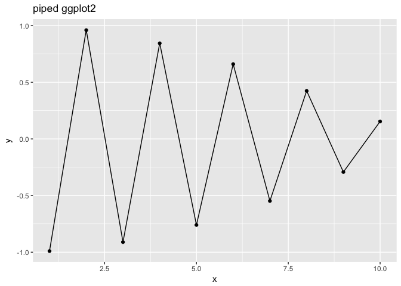

ggplot2\_piped.Rmd
================
John Mount, Win-Vector LLC
1/29/2018

Using [`wrapr`](https://winvector.github.io/wrapr/)'s pipe with `ggplot2` (as in [Why can’t ggplot2 use %.&gt;%?](https://community.rstudio.com/t/why-cant-ggplot2-use/4372)).

``` r
#' Pipe step operator (requires wrapr 1.2.0 or newer).
#'
#' @param pipe_left_arg pipe_left_arg argument
#' @param pipe_right_arg substitute(pipe_right_arg) argument
#' @param env environment to evaluate in
#' @return result
#'
#' @export
#'
pipe_step.ggplot <- function(pipe_left_arg, pipe_right_arg,
                             pipe_environment) {
  pipe_right_arg <- eval(pipe_right_arg,
                         envir = pipe_environment,
                         enclos = pipe_environment)
  pipe_left_arg + pipe_right_arg
}


library("ggplot2")
library("wrapr")
suppressPackageStartupMessages(library("dplyr"))

d <- data.frame(x = 1:10,
                y = cos(1:10))

d %.>%
  mutate(., y = y*y) %.>%
  ggplot(.,
         aes(x = x,  y = y)) %.>%
  geom_point() %.>%
  geom_line() %.>%
  ggtitle("piped ggplot2")
```


